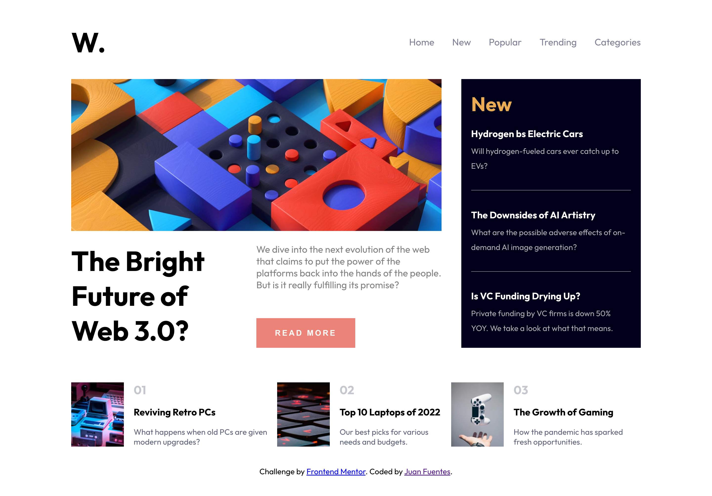
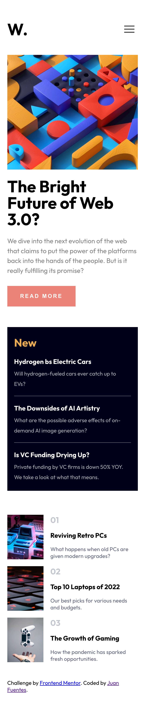

# Frontend Mentor - News homepage solution

This is a solution to the [News homepage challenge on Frontend Mentor](https://www.frontendmentor.io/challenges/news-homepage-H6SWTa1MFl). Frontend Mentor challenges help you improve your coding skills by building realistic projects. 

## Table of contents

  - [The challenge](#the-challenge)
  - [Screenshot](#screenshot)
  - [Links](#links)
  - [My process](#my-process) 
  - [Built with](#built-with)
  - [Author](#author)
  - [Getting Started with Create React App](#getting-started-with-create-react-app)

### The challenge

Users should be able to:

- View the optimal layout for the interface depending on their device's screen size
- See hover and focus states for all interactive elements on the page

### Screenshot

### Links

- Solution URL: [Add solution URL here](https://github.com/JuanFuentes20/news-homepage)
- Live Site URL: [Live site URL here](https://juanfuentes20.github.io/news-homepage/)

## My process

Analyze the wanted design and identify different sections for the web page.

### Built with

- Semantic HTML5 markup
- CSS custom properties
- Flexbox
- Mobile-first workflow
- [React](https://reactjs.org/) - JS library

## Author

- Website - [Add your name here](https://juanfuentes20.github.io/news-homepage/)
- Frontend Mentor - [@JuanFuentes20](https://www.frontendmentor.io/profile/JuanFuentes20)

# Getting Started with Create React App

This project was bootstrapped with [Create React App](https://github.com/facebook/create-react-app).

## Available Scripts

In the project directory, you can run:

### `npm start`

Runs the app in the development mode.\
Open [http://localhost:3000](http://localhost:3000) to view it in your browser.

The page will reload when you make changes.\
You may also see any lint errors in the console.

